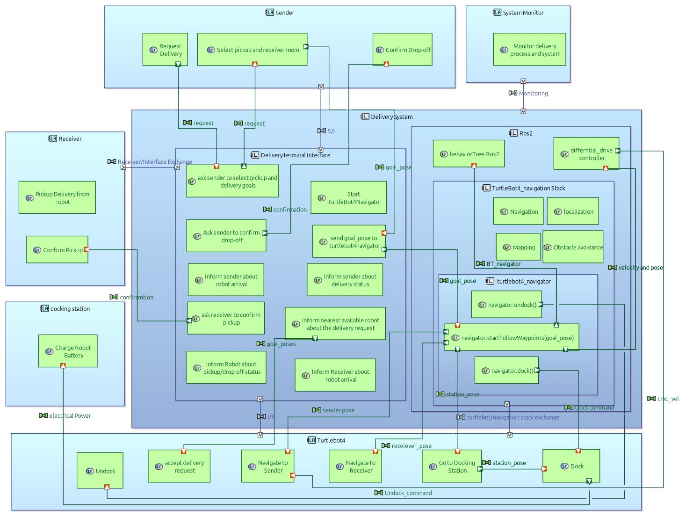
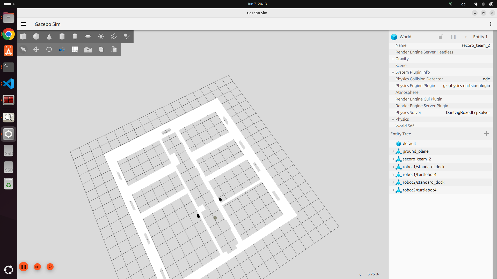
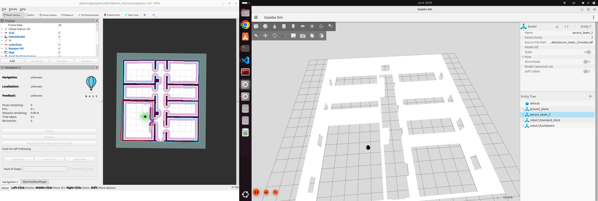

# Assignment 3 – Team 2

## 📦 Deliverables

---

### Task 1 and 2

- See [`assignment_3_task1_team_2_SECORO.pdf`](./assignment_3_task1_team_2_SECORO.pdf)
and also see : [`presentation_team2.pdf`](./presentation_team2.pdf)
Note: this presentation is not complete. [`assignment_3_task1_team_2_SECORO.pdf`](./assignment_3_task1_team_2_SECORO.pdf) and [`System architecture diagram`](./System_Architecture_Diagram.jpg) are the main solutions for task 1 and 2.

We used the software capella to model the system architecture diagram and we are planning to use this capella for further development of our project.
Note: Capella is an open-source Model-Based Systems Engineering (MBSE) tool designed to support the modeling and design of complex systems, particularly those with hardware, software, and system architecture components.

With capella we can also manage requierments and we can model System capabilites, activities, functions, behaviors, state machines, hardware and software components, operational, logical and physical architectures and more.

If you are interested yu can download capella and view our model. You can find our capella model here: [`secoro_team2_capella`](./secoro_team2_capella/secoro_team2/) but it still not complete since only the System architecture diagram is asked for this assignment


---

### Task 3
For Detailed instructions to run the prototype, please refer to the readme file [`readme.md`](./robot_delivery_system_pkg/README.md) under robot_delivery_system_pkg and to the [`System architecture diagram`](./System_Architecture_Diagram.jpg) and to the [delivery_interface](./robot_delivery_system_pkg/delivery_interface/) ([`delivery commander.py`](./robot_delivery_system_pkg/delivery_interface/delivery_interface/delivery_commander.py)
[`secoro_delivery_interface.py`](./robot_delivery_system_pkg/delivery_interface/delivery_interface/secoro_delivery_interface.py)) package for more information. 

 

We could not test our  delivery_interface because we had problem with the turtlebot4_navigation node / server. Navigate to Pose did not work even with and without rviz and even by using the original  mail_delivery tutorial of turtlebot4. 

 

But we created a detailed system architecture diagram to explain our code and our approach, and you can view our main code  under [`robot_delivery_system_pkg/delivery_interface/delivery_interface/delivery_commander.py`](./robot_delivery_system_pkg/delivery_interface/delivery_interface/delivery_commander.py). or the simple alternative one [`secoro_delivery_interface.py`](./robot_delivery_system_pkg/delivery_interface/delivery_interface/secoro_delivery_interface.py)


Thery are 2 differnt approaches.  

secoro_delivery_interface.py uses turtlebot4_navigator  

```bash

navigator = TurtleBot4Navigator() 

[...] 

Navigator.startToPose(goal_options[selected_index]['pose'] 

 ```

and delivery commander.py  uses NavigateToPose 

```bash

self.client = ActionClient(self, NavigateToPose, f'/{self.namespace}/navigate_to_pose') 

[...] 

goal = NavigateToPose.Goal() 

 ```
 
 
 spawning 2 robot with thei docking stations




 naviagtion attemp

 