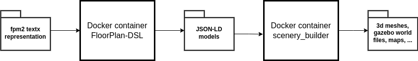
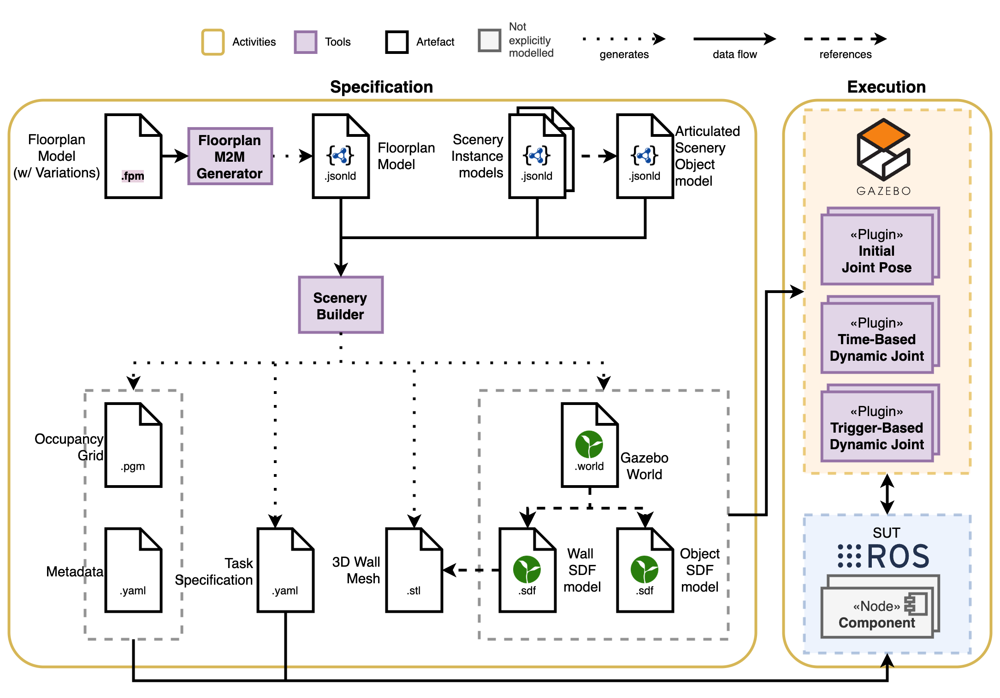

## FloorPlan-DSL
"The FloorPlan DSL is a model-driven approach to specify indoor environments. The language enables developers to **model** indoor environments by its **components** such as spaces, entryways, and other **features** such as windows and columns; allowing the re-creation of real-world environments, or the creation of new ones.

The models can be **transformed** into 3D meshes and occupancy grid maps, which can be used to simulate robot navigation tasks in most robot simulators." ([source](https://github.com/secorolab/FloorPlan-DSL))   
The tooling for this transformation can be found in the [scenery_builder](https://github.com/secorolab/scenery_builder) repository.

### Installation
- Clone the devel branch of [FloorPlan-DSL](https://github.com/secorolab/FloorPlan-DSL/tree/devel) repository
  ```
  git clone --single-branch --branch devel https://github.com/secorolab/FloorPlan-DSL.git
  ```
- We will use the docker container for ease of use, as recommended in the  [documentation](https://secorolab.github.io/FloorPlan-DSL/). Build the docker container from within this repository. If you are not using docker, skip this and the next step
  ```
  docker build . --tag floorplan:latest
  ```
- Pull the docker image of the scenery_builder tooling to transform the models to different representations of the environment
  ```
  docker pull ghcr.io/secorolab/scenery_builder:devel
  ```
- If you are not using Docker, please ensure that Python 3.11 is installed on your system. If not installed,
  ```
  sudo apt update
  sudo apt install -y software-properties-common
  sudo add-apt-repository ppa:deadsnakes/ppa
  sudo apt update
  sudo apt install python3.11 python3.11-venv python3.11-dev python3.11-distutils
  ```
- Create a virtual environment using Python 3.11
  ```
  python3.11 -m venv fp_dsl_venv
  source fp_dsl_venv/bin/activate
  ```
- Once the virtual environment is active, follow the installation steps provided in the [FloorPlan-DSL](https://github.com/secorolab/FloorPlan-DSL) and [scenery_builder](https://github.com/secorolab/scenery_builder) repositories for Docker-independent setup

- Before generating metamodels and world files, install the Blender Python module (bpy version==4.1.0) after activating the virtual environment
  ```
  pip install bpy==4.1.0
  ```

### Workflow
- In this workflow, we will understand how to generate the map files and the gazebo world files among others, assuming we already have the textual model of the environment
- Diagrams of the data flow and the complete pipeline

  

  **Figure 1.** Data flow diagram, where the FloorPlan-DSL docker container is used to parse the floorplan models to json-ld representation. Which is further used by scenery_builder docker container to generate the different files representing the world

  

  **Figure 2.** Pipeline of generation of 3D mesh, Gazebo world files, and map files from textx specification (adapted from [1]) 

- Refer to this [documentation](https://secorolab.github.io/FloorPlan-DSL/) for details on installation and generation of models from textX generators. We will follow the main steps involved in the workflow below
- Create three folders at any path of your choice, where,
	-  first folder should consist of **fpm files** that you write
	- second folder will be where you want generate the **JSON-LD representation** of them
	- third folder where you want all **files related to the environment** to be generated
- Copy any of the files with an extension `fpm` to the folder that you created to store fpm files
- Run the docker container by mapping local folders where you have fpm files and where you want to generate the JSON-LD files to the corresponding folders within the FloorPlan-DSL container. A sample for running the container is provided below
  ```
  docker run -v ./jsonld_models:/usr/src/app/output -v ./fpm_models:/usr/src/app/models -u $(id -u):$(id -g)  -it floorplan:latest bash
  ```
* From within the container, execute the following command to generate the JSON-LD models. We assume the environment is named `hbrs`
  ```
  textx generate models/hbrs.fpm --target json-ld -o output/
  ```
- Now exit from the FloorPlan-DSL container and run the scenery_builder docker container to transform the generated json-ld format of models to different files related to the the environment. Similar to the above step, you have to link the relevant input and output folders
  ```
  docker run -v ./world_models:/usr/src/app/output -v ./jsonld_models:/usr/src/app/models ghcr.io/secorolab/scenery_builder:devel
  ```
- Now you should be able to look into all the generated files related to the environment

### Tutorial
- We will look into how the model of the environment look like and how to model it using textX language interface. We will follow the tutorial and the concepts involved from the below links
- Links: [Tutorial](https://github.com/secorolab/FloorPlan-DSL/blob/devel/docs/Tutorial.md), [Concepts](https://github.com/secorolab/FloorPlan-DSL/blob/devel/docs/concepts.md)

## Spawning the Environment in Gazebo
- To spawn the robot in the environment, pass the location where the relevant files are located with the launch file, which is appended to **GZ_SIM_RESOURSE_PATH** environment variable. The file paths should include,
	- <world_models>/gazebo/models
	- <world_models>/gazebo/worlds
	- <world_models> 
- For example, you can launch the simulation environment by setting the environment variable via gz_resource_path launch argument, which includes complete path until the generated world files as a colon separated list as shown below, where <world_models> is a complete path where the world files are generated
  ```
  ros2 launch turtlebot4_gz_bringup turtlebot4_gz.launch.py world:=hbrs gz_resource_path:=<world_models>/gazebo/models:<world_models>/gazebo/worlds:<world_models>
  ```
- Now you should be able to visualize the sensor data in the simulation environment and also in rviz2
## References
[1] Ortega, A., Parra, S., Schneider, S., & Hochgeschwender, N. (2024). Composable and executable scenarios for simulation-based testing of mobile robots. Frontiers in Robotics and AI, 11, 1363281.